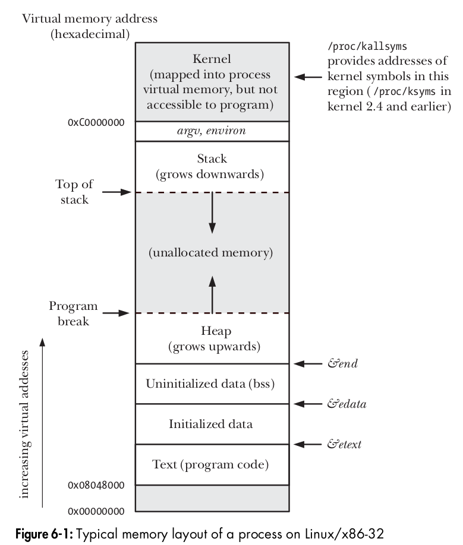

A `program` is a file containing a range of information that describes how to construct a `process` at run time.

Informations in file are:  
**Binary format identifier**:

Format of the program. Widely used formats are in olden days `a.out(assembler output)` and  `COFF(Common Object File Format)`. Now a days `ELF(Executable and Linking Format)`.

`file ./a.out`

**Machine instructions**:

Contains compiled machine code (.text section). CPU executes this code when the process runs.  
 
**Program entry-point address**:

Address where execution starts (usually main() after some runtime startup).

`readelf -h a.out | grep Entry`

**Data**:

Values used to initialize variables and Constants
.data: global/static variables with initial values

.rodata: string literals, consts

.bss: globals/statics set to 0

`readelf -S a.out`


**Symbol and relocation table**:

*Symbol table*:

A symbol is a name associated with an address in your code or data for eg: functions (main, printf,..), variables (int c, ab ,...). This symbol table is maintained by compiler and linker that maps the symbol name and address for that to refer. It is used for Linking, debugging, dynamic loading,..

To view symbol table `nm a.out` or `readelf -s a.out`


*Relocation table*:

Relocation is the process of adjusting addresses in your program after linking or loading, especially when: You use external functions like printf, You use shared libraries, The loader loads your program at a different address

To view relocation table `readelf -r a.out`

**Shared-library and dynamic-linking information**:

List of shared libraries that the program needs at run time and the pathname of the dynamic linker that should load these libraries

`readelf -d a.out` for loader and `readelf -S a.out` for linker

dynamic link info `ldd ./a.out` To list shared libraries the program will load.


**Other information**:
Other information to describe the construction of a process

One program can be used to construct many processes, or many processes may be running the same program.
According to the kernel, a process consists of user-space memory (code, variables, etc.) and kernel-space memory (a range of kernel data structures that maintain the state of the process, such as IDs, virtual memory tables, open file descriptors, signal delivery and handling, etc.).


## Memory layout  
Memory allocated to each process is composed of number of parts, referred as segments.

**Text**

This has the machine instructions of the program.  
It is readonly section  
It is shared segment so that many process can use same text segment

**initialized data segment (data)**  

Contains initialized static and global variable. 
The vales are read from executable file when the program is loaded into memory

**uninitialized data segment (bss)** 

Contains uninitialized static and global variable.  
Before starting the program system initilize the values to 0

why initialized and uninitialized are stored differently?

Executable file no need to allocate memory for uninitialized memory. Instead it just record the size and location of the memory. Memory is allocated ate run time by loader

**stack**

This is dynamically growing memory. For each function call it will create a stack memory.
Stack memory for a function call consists of function arguments, (automatic variable) local variable and return values.  

**heap**

This is dynamically allocated memory at run time. The top end of the heap is called `program break`.

size command displays the size of text, initialized data and uninitialized segments
`size a.out`

### diagram


```c
extern char etext;  // etext -> address of end of the program text/ start of the initialized data
extern char edata;  // edata -> end of the initialized data segment
extern char end;    // end   -> end of yhe uninitilized data segment
```

### program
[layout](layout.c), [stack_overflow](stack_overflow.c)